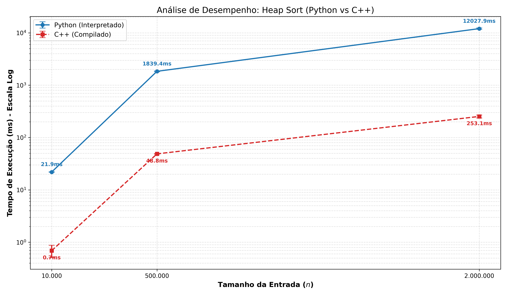

# 📊 Heap Sort: Complexity Analysis & Benchmark

A comparative study of the Heap Sort algorithm implemented in Python (interpreted) and C++ (compiled). This project analyzes the time complexity $\Theta(n \log n)$ and contrasts the runtime performance between high-level and low-level languages using real-world datasets.

Developed for the Theory of Computation course.

## 📖 Table of Contents

Overview

Features

Project Structure

Prerequisites

How to Run

Results & Analysis

Theoretical Background

License

## 🧐 Overview

This project aims to empirically validate the theoretical time complexity of the Heap Sort algorithm. By running the algorithm against datasets of increasing sizes ($10^4$, $5 \times 10^5$, $2 \times 10^6$), we observe the behavior of $O(n \log n)$ and measuring the execution time gap between an interpreted language with dynamic typing (Python) versus a compiled language with manual memory management (C++).

## 🚀 Features

Dual Implementation:

C++20: Optimized implementation using std::vector and -O3 compilation flag.

Python 3: Standard implementation demonstrating algorithmic logic.

Automated Benchmarking: A Python driver script (automacao_teste.py) that:

Generates random datasets (Small, Medium, Large).

Automatically compiles the C++ source code.

Runs multiple iterations (default: 20) to ensure statistical significance.

Calculates Average Runtime and Standard Deviation.

Advanced Visualization: A Matplotlib script (gerar_grafico_robusto.py) that generates Log-Scale performance graphs with error bars to visualize the order of magnitude difference.

## 📂 Project Structure

```
.
├── HeapSort(C++).cpp         # C++ Source Code (Optimized)
├── HeapSort(Python).py       # Python Source Code
├── GeradorDeDados.py         # Data Generator Script
├── automacao_teste.py        # Benchmark Driver (Main Script)
├── gerar_grafico_robusto.py  # Visualization Generator
├── dados_pequenos.txt        # Generated Dataset (10k)
├── dados_medios.txt          # Generated Dataset (500k)
├── dados_grandes.txt         # Generated Dataset (2M)
└── README.md                 # Project Documentation
```

🛠️ Prerequisites

Before running the benchmarks, ensure you have the following installed:

Python 3.10+

G++ Compiler (Must support C++20 standard)

Python Libraries:

pip install matplotlib numpy


## ⚙️ How to Run

### 1. Clone the Repository
```
git clone https://github.com/AntonioPaess/heapsort-complexity-analysis.git

cd heapsort-complexity-analysis
```

### 2. Run the Benchmark Automation

This script will generate the data files (if missing), compile the C++ code, run the tests, and display the results table in the terminal.

python3 automacao_teste.py


Expected Output:


### 3. Generate the Comparison Graph

After obtaining the values from the terminal, open gerar_grafico_robusto.py, update the py_media, cpp_media arrays with your real data, and run:

python3 gerar_grafico_robusto.py


This will generate a high-resolution image named grafico_robusto_heapsort.png.

## 📈 Results & Analysis

Comparative Graph



Key Findings

Theoretical Consistency: Both languages demonstrated a growth curve consistent with $\Theta(n \log n)$. The time does not grow linearly ($O(n)$) nor quadratically ($O(n^2)$).

Performance Gap: The C++ implementation was consistently orders of magnitude faster than Python. This is attributed to:

Compilation vs. Interpretation: C++ is compiled directly to machine code.

Memory Management: C++ allows low-level memory control, whereas Python has overhead from the Global Interpreter Lock (GIL) and automatic garbage collection.

Type System: Static typing in C++ allows for compile-time optimizations not possible in Python's dynamic typing.

## 🧠 Theoretical Background

Complexity Class

Is Heap Sort in P? Yes. Since it runs in polynomial time ($O(n \log n)$ is strictly less than $O(n^2)$), it belongs to the Complexity Class P.

Is it in NP? Yes. Since $P \subseteq NP$, any problem that can be solved in polynomial time can also have its solution verified in polynomial time.

Stability

Heap Sort is not a stable sort. The operations on the heap structure can change the relative order of equal elements.

## 📝 License

This project is licensed under the MIT License - see the LICENSE file for details.

Created by Antônio Paes, Marco Maciel, Galileu Calaça, João Henrique
